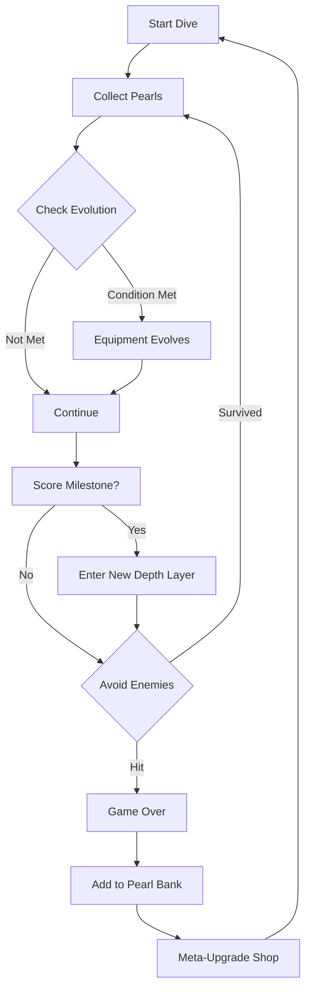

# ABYSS DIVER — Feature Proposal & Level Design Document

---

## 1. Research Summary

### Vampire Survivors — Key Learnings
| Feature | How It Works | Abyss Diver Adaptation |
|---------|--------------|------------------------|
| **Weapon Evolution** | Weapon + Accessory = Evolved Form | Equipment + Pearl Type = Upgraded Gear |
| **6 Weapons + 6 Passives** | Build variety through combination | 3 Active Tools + 3 Passive Buffs |
| **Permanent Upgrades** | Gold spent between runs | Pearls = Currency for meta-progression |
| **Arcanas** | Powerful modifiers unlocked via challenges | "Deep Sea Relics" — rare drops |

### Dave the Diver — Key Learnings
| Feature | How It Works | Abyss Diver Adaptation |
|---------|--------------|------------------------|
| **Equipment Tiers** | Air Tank, Suit, Cargo upgrades | Oxygen, Depth, Carry Capacity upgrades |
| **Catch Quality (⭐)** | Method affects yield | Perfect Catch bonus (no damage = 2x) |
| **Depth Progression** | Suit upgrades = deeper zones | Score thresholds unlock deeper "layers" |
| **Day/Night Loop** | Dive → Restaurant | Dive → Upgrade Shop between runs |

### Graveyard Keeper — Key Learnings
| Feature | How It Works | Abyss Diver Adaptation |
|---------|--------------|------------------------|
| **Tech Tree** | Branching unlocks via Red/Green/Blue points | Simple linear unlock tree |
| **Multi-Resource Points** | Different actions = different points | Score + Combo = Upgrade Points |
| **Study Table** | Research items for knowledge | "Analyze Pearl" for bonus unlocks |
| **NPC Schedules** | Time-based interactions | Boss spawns at milestone scores |

---

## 2. Proposed Feature List

### 2.1 Equipment Evolution System (Priority: HIGH)

**Concept:** Tools evolve as you collect matching resources.

| Base Equipment | Evolution Condition | Evolved Form | Effect |
|----------------|---------------------|--------------|--------|
| **Hook** | Collect 50 Pearls | **Grappling Hook** | +50% range, auto-pull speed |
| **Buoy** | Survive 3 mins | **Pressure Shield** | Ignore 1 mine hit |
| **Flashlight** | Score 200 | **Sonar** | Pearls glow, mines visible earlier |
| **Net** | Catch 10 perfect | **Wide Net** | +100% magnet radius |

### 2.2 Pearl Variety (Priority: MEDIUM)

**Concept:** Different pearl types with varying values and effects.

| Pearl Type | Spawn Rate | Value | Special Effect |
|------------|------------|-------|----------------|
| **White Pearl** | 60% | 10 pts | Standard |
| **Golden Pearl** | 25% | 25 pts | Small XP boost |
| **Black Pearl** | 10% | 50 pts | Temporary speed boost |
| **Abyssal Pearl** | 5% | 100 pts | Trigger evolution condition |

### 2.3 Enemy Evolution (Priority: HIGH)

**Concept:** Enemies get stronger as score increases.

| Score Range | Enemy Type | Behavior |
|-------------|------------|----------|
| 0-99 | **Sea Mine** | Falls straight down |
| 100-249 | **Drifting Mine** | Falls + slight horizontal drift |
| 250-499 | **Homing Jellyfish** | Slowly tracks player |
| 500+ | **Depth Charger** | Fast mines spawn in bursts |

### 2.4 Meta-Progression (Between Runs)

**Concept:** Pearls collected = permanent currency.

| Upgrade | Cost | Effect |
|---------|------|--------|
| **Starting Speed +10%** | 500 Pearls | Permanent |
| **Hook from Start** | 1000 Pearls | No score requirement |
| **Extra Life** | 2000 Pearls | Survive one hit per run |
| **Pearl Magnet Range** | 300 Pearls | +25% base range |

### 2.5 Level Design: Depth Layers

**Concept:** Visual/mechanical changes at score milestones.

| Layer | Score Threshold | Visual Change | New Mechanic |
|-------|-----------------|---------------|--------------|
| **Shallows** | 0-99 | Light blue water | Basic gameplay |
| **Twilight Zone** | 100-249 | Darker blue, particles | Hook unlocks |
| **Midnight Zone** | 250-499 | Dark, bioluminescence | Glowing pearls |
| **The Abyss** | 500+ | Black, red glow | All enemy types |

---

## 3. Core Loop Enhancement



---

## 4. Competitive Balance

### Dynamic Difficulty Formula
```
spawn_rate = base_rate * (1 + score / 200)
enemy_speed = base_speed * (1 + score / 500)
spawn_ratio_enemies = min(0.5, 0.2 + score / 1000)
```

### Risk/Reward
- **High Score = More Enemies** → Maintains challenge
- **Pearl Types = Strategic Choice** → Black Pearls risky but rewarding
- **Evolution = Power Spike** → Incentivizes meeting conditions

---

## 5. Recommended Implementation Order

### Phase A: Foundation (Immediate)
1. [ ] Pearl variety (White, Golden, Black, Abyssal)
2. [ ] Enemy scaling (speed, spawn rate increase)
3. [ ] Depth layer visuals (background color shifts)

### Phase B: Progression (Next)
1. [ ] Equipment evolution system (Hook → Grappling Hook)
2. [ ] Meta-progression shop (between runs)
3. [ ] New enemy types (Jellyfish, Depth Charger)

### Phase C: Polish
1. [ ] Achievement system
2. [ ] Leaderboards
3. [ ] Sound effects per layer

---

## 6. UI/UX Recommendations

| Screen | Change |
|--------|--------|
| **HUD** | Add equipment icon + evolution progress bar |
| **Game Over** | Show "Pearls Earned This Run" + "Total Bank" |
| **New Screen: Shop** | Between runs, spend pearls on upgrades |
| **Depth Indicator** | Visual meter showing current depth layer |

---

*Document Version: 1.0*
*Last Updated: 2026-01-12*
